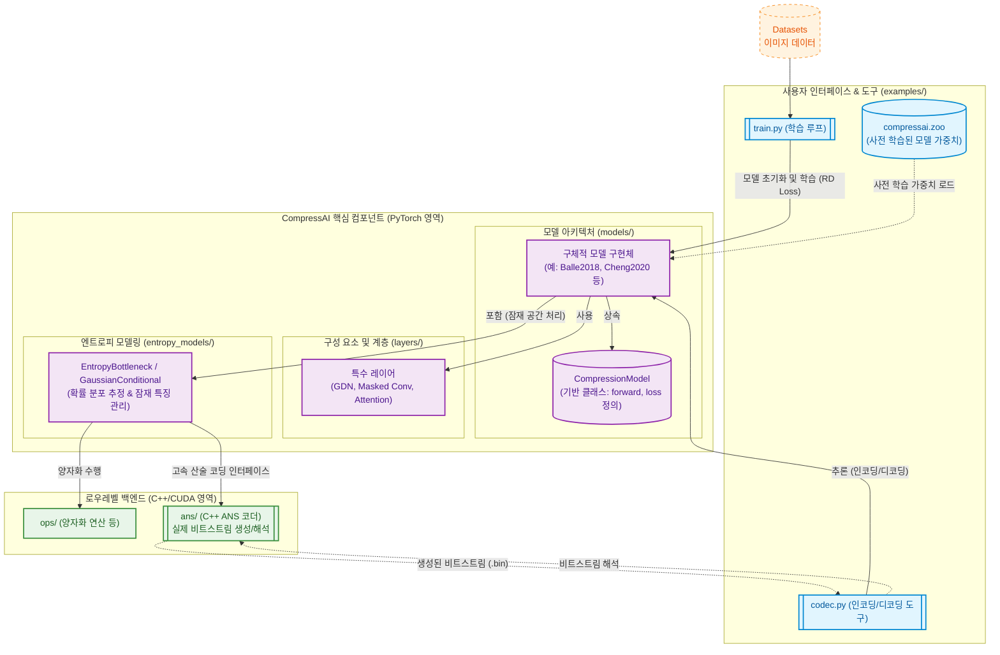

```mermaid
graph TD
    %% 스타일 정의
    classDef userGroup fill:#e1f5fe,stroke:#0288d1,stroke-width:2px,color:#01579b;
    classDef coreGroup fill:#f3e5f5,stroke:#8e24aa,stroke-width:2px,color:#4a148c;
    classDef backendGroup fill:#e8f5e9,stroke:#388e3c,stroke-width:2px,color:#1b5e20;
    classDef external fill:#fff3e0,stroke:#f57c00,stroke-dasharray: 5 5,color:#e65100;

    %% --- User Interface Layer ---
    subgraph UserInterface ["사용자 인터페이스 & 도구 (examples/)"]
        direction TB
        TrainScript[["train.py (학습 루프)"]]:::userGroup
        CodecScript[["codec.py (인코딩/디코딩 도구)"]]:::userGroup
        Zoo[("compressai.zoo\n(사전 학습된 모델 가중치)")]:::userGroup
    end

    Data[(Datasets\n이미지 데이터)]:::external

    %% --- Core Modeling Layer ---
    subgraph Core ["CompressAI 핵심 컴포넌트 (PyTorch 영역)"]
        direction TB
        
        subgraph ModelArch ["모델 아키텍처 (models/)"]
            ConcreteModels["구체적 모델 구현체\n(예: Balle2018, Cheng2020 등)"]:::coreGroup
            BaseModel[("CompressionModel\n(기반 클래스: forward, loss 정의)")]:::coreGroup
        end

        subgraph BuildingBlocks ["구성 요소 및 계층 (layers/)"]
            CustomLayers["특수 레이어\n(GDN, Masked Conv, Attention)"]:::coreGroup
        end

        subgraph EntropyModeling ["엔트로피 모델링 (entropy_models/)"]
            EntropyBottleneck["EntropyBottleneck / GaussianConditional\n(확률 분포 추정 & 잠재 특징 관리)"]:::coreGroup
        end
    end

    %% --- Backend Layer ---
    subgraph Backend ["로우레벨 백엔드 (C++/CUDA 영역)"]
        Ops["ops/ (양자화 연산 등)"]:::backendGroup
        ANS[["ans/ (C++ ANS 코더)\n실제 비트스트림 생성/해석"]]:::backendGroup
    end

    %% --- Relationships and Flows ---

    %% Data Loading
    Data --> TrainScript

    %% User Script Interactions
    TrainScript -- "모델 초기화 및 학습 (RD Loss)" --> ConcreteModels
    CodecScript -- "추론 (인코딩/디코딩)" --> ConcreteModels
    Zoo -.->|"사전 학습 가중치 로드"| ConcreteModels

    %% Internal Core Interactions
    ConcreteModels -- "상속" --> BaseModel
    ConcreteModels -- "사용" --> CustomLayers
    ConcreteModels -- "포함 (잠재 공간 처리)" --> EntropyBottleneck

    %% Connecting to Backend
    EntropyBottleneck -- "양자화 수행" --> Ops
    EntropyBottleneck -- "고속 산술 코딩 인터페이스" --> ANS

    %% Bitstream Flow (Conceptual)
    ANS -.->|"생성된 비트스트림 (.bin)"| CodecScript
    CodecScript -.->|"비트스트림 해석"| ANS
```
